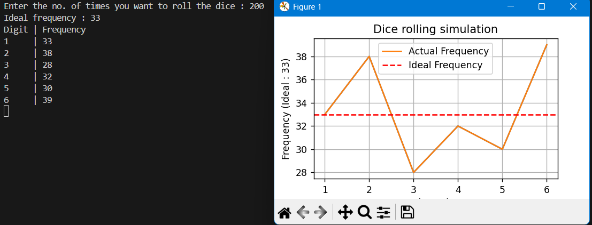

# Jackfruit-problem---Dice-simulation-with-stats
Built using Python, uses 'random' module to generate a random dice roll over a number of trials and visualises this data using 'Matplotlib'

# Sample outputs

